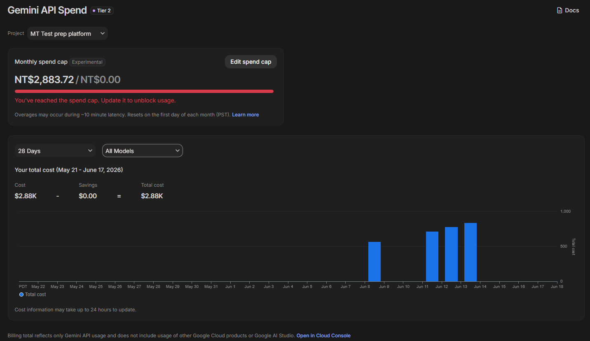

# 醫檢師國考刷題系統 (MT Exam Prep System)

這是一個專為醫檢師國考設計的「**綠色免安裝便攜版**」本地端刷題系統。您可以將整個程式放在隨身碟中，帶到任何 Windows 電腦（如圖書館、醫院公用電腦）上即插即用。所有刷題進度、錯題本、重點螢光筆紀錄都會保存在隨身碟中，讓您隨時隨地保持最佳學習狀態。

---

## ⚡ 快速一鍵安裝 (推薦)

如果您是第一次使用，或想把這個系統分享給同學，請直接使用這段指令。它會自動從 GitHub 下載最新版的系統，並自動在您的桌面上解壓縮、甚至繞過安全阻擋，完全不需要繁瑣的手動操作！

### 🪟 Windows 使用者
1. 在 Windows 的「開始」按鈕按右鍵，選擇 **Windows PowerShell**（或終端機）。
2. 將以下整段指令複製，貼上到黑色/藍色視窗中，並按下 `Enter` 鍵。

```powershell
[Net.ServicePointManager]::SecurityProtocol = [Net.SecurityProtocolType]::Tls12; $desk = [Environment]::GetFolderPath('Desktop'); $url = "https://github.com/CNH3148/mt-exam-helper/releases/download/v2.1.115-2/MT_Exam_Prep_Portable_v2.1.115-2_Windows.zip"; $zip = "$desk\temp_exam.zip"; iwr -Uri $url -OutFile $zip; Expand-Archive -Path $zip -DestinationPath "$desk\醫檢師刷題系統_Windows" -Force; rm $zip
```
*(執行完畢後，桌面會出現「醫檢師刷題系統_Windows」資料夾，點擊裡面的 `Start_App.bat` 即可開始刷題！)*

### 🍎 Mac 使用者 (Beta 版)
1. 按下 `Command + 空白鍵` 搜尋並打開 **「終端機 (Terminal)」**。
2. 將以下整段指令複製，貼上到終端機視窗中，並按下 `Enter` 鍵。

```bash
cd ~/Desktop && curl -L -o temp_exam_mac.zip "https://github.com/CNH3148/mt-exam-helper/releases/download/v2.1.115-2/MT_Exam_Prep_Portable_v2.1.115-2_Mac-Beta.zip" && unzip -q temp_exam_mac.zip -d 醫檢師刷題系統_Mac && rm temp_exam_mac.zip && xattr -cr 醫檢師刷題系統_Mac
```
*(這段指令會自動下載並為您解除 Mac 的 Gatekeeper 隔離機制。執行完畢後，桌面會出現「醫檢師刷題系統_Mac」資料夾，點擊裡面的 `Start_App.command` 即可開始刷題！)*

---

## 📂 手動下載與解壓縮 (替代方案)

如果您不習慣使用指令，或是電腦環境不允許執行終端機，您也可以手動下載安裝：

1. 前往本專案右側的 **Releases** 頁面。
2. 找到最新版本，依照您的作業系統下載對應的壓縮檔（Windows 請下載 `MT_Exam_Prep_Portable_v2.1.115-2_Windows.zip`；Mac 請下載 `MT_Exam_Prep_Portable_v2.1.115-2_Mac-Beta.zip`）。
3. 下載完成後，將壓縮檔 **解壓縮**。
4. 將解壓縮出來的資料夾放到桌面或隨身碟中。
5. **Windows**：進入資料夾，雙擊執行 `Start_App.bat` 即可開始刷題。
6. **Mac**：若手動下載，首次開啟可能遇到蘋果的 Gatekeeper 阻擋，請開啟終端機執行 `xattr -cr ` 然後把資料夾拖進去按 Enter 解除隔離，之後雙擊 `Start_App.command` 即可執行。（詳細圖文教學請見資料夾內的 `Mac使用說明.md`）

---

## 💻 系統需求與支援平台

- **作業系統**：支援 **Windows 10/11 (64-bit)** 與 **macOS**。
- **硬體需求**：幾乎所有能上網的電腦皆可順暢執行。
- ⚠️ **暫不支援行動裝置**：目前尚無法在手機/平板上以本機伺服器模式運行。（未來若有時間將再研究行動裝置的支援方案）。

---

## 📖 系統核心功能簡介

本系統提供四大核心刷題模式，並具備**客製化標籤與筆記**、**Anki 記憶卡一鍵匯出**，以及**高度隱私保護**（本機伺服器限制於 127.0.0.1）等輔助功能。

| 模式名稱 | 功能特色與介紹 |
| :--- | :--- |
| **一般模式** | 依序進行歷屆考題的練習。包含兩個層級的結構設計：<br>1. **選擇考科**：精準鎖定單一科目（如：臨床生理學與病理學）。<br>2. **選擇年度**：挑選特定年份與梯次（如：112年第一次）。<br>方便考生針對特定科目的特定年份進行地毯式的完整複習。 |
| **錯題模式** | 專為考前衝刺設計的智慧錯題本。答錯的題目會自動收錄並加上紅色標記，當您在此模式中重新答對時，系統會自動將其標記為「已更正 (Fixed)」。 |
| **收藏模式** | 集中複習重點題目的專區。您可以將難題加上特定標籤（如 `#必考`、`#寄生蟲`）或星號，並在此模式下專注攻克這些收藏題。 |
| **搜尋模式** | 關鍵字檢索系統。可快速搜尋題庫中特定的專有名詞或考點，方便尋找相關題目與釐清相似觀念。 |


## 🙏 致謝與參考資料 (Acknowledgments)

本專案的誕生，特別感謝開源社群的貢獻。在系統開發初期，我們參考了 [pofeng/exams_tw](https://github.com/pofeng/exams_tw) 專案中的程式碼架構與歷屆考題資料處理邏輯。感謝原作者的開源精神，為本系統的資料清洗與題庫建立提供了寶貴的啟發與基礎！

---

## 💸 血淚開發成本 (Development Cost)

為了讓系統擁有高品質的歷屆考題與詳解資料，我們在開發初期投入了大量的 AI 運算資源進行資料清洗與提取。在此特別紀錄這段開發血淚史 QQ：

- **Google Gemini API 使用費**：約 **NT$ 2,883.72**
- 此費用主要用於百萬字級別的考題 PDF 轉換、選項萃取與答案驗證。



---

## 🧠 系統設計想法 (Design Thoughts)

> 💡 **想了解本系統的技術細節與開發歷史？**
> 本專案經歷了從資料清洗、伺服器建置到 UI 優化的完整過程，如果您對程式碼架構或開發歷史感興趣，歡迎參閱 [技術細節與開發歷史 (DEVELOPMENT.md)](./docs/DEVELOPMENT.md)。

> *(作者保留區塊：之後將補上開發這個醫檢師刷題系統的初衷、遇到的痛點，以及未來可能的擴充計畫等心得。)*

這個系統最初是為了解決醫檢師國考刷題的不便而生，但在開發的過程中，我們逐漸發現這個架構其實具備極高的**泛用性潛力**。

未來，我們考慮將這個底層架構抽離出來，做成一個**通用性的開源工具**。它將不僅限於醫檢師考試，而是能夠面向任何具備以下特性的情境：
1. **有固定的核心考點**
2. **具備龐大且範圍廣闊的題庫**
3. **有大量考古題可供進行 AI 數據分析與提取**

希望能透過這套系統架構，幫助更多在茫茫題海中苦讀的考生，找到更有效率的學習方法！

---
*Developed with ❤️ for Medical Technologists.*
